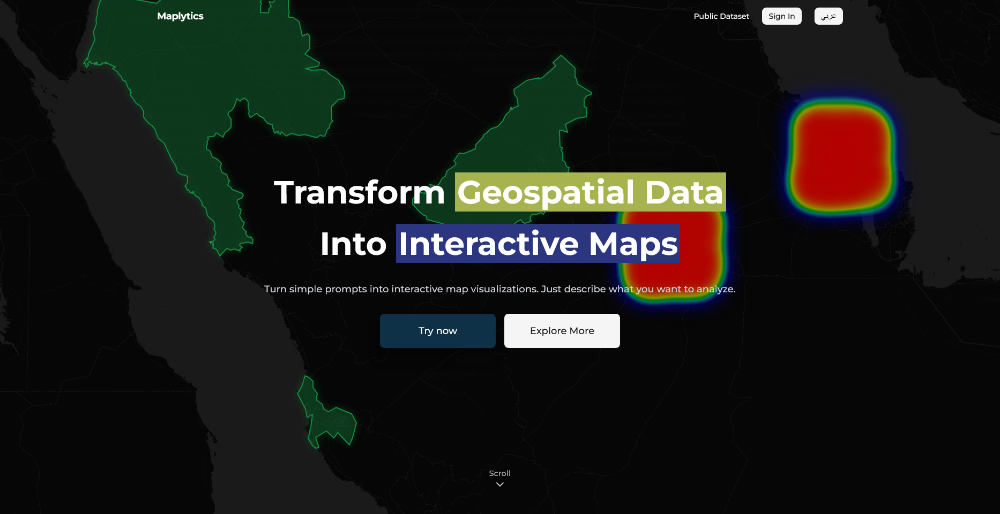
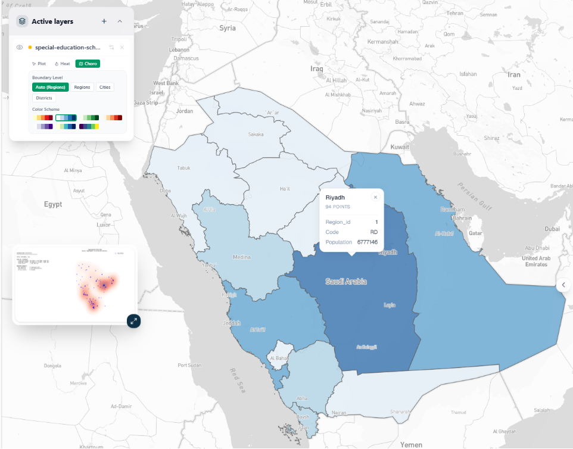
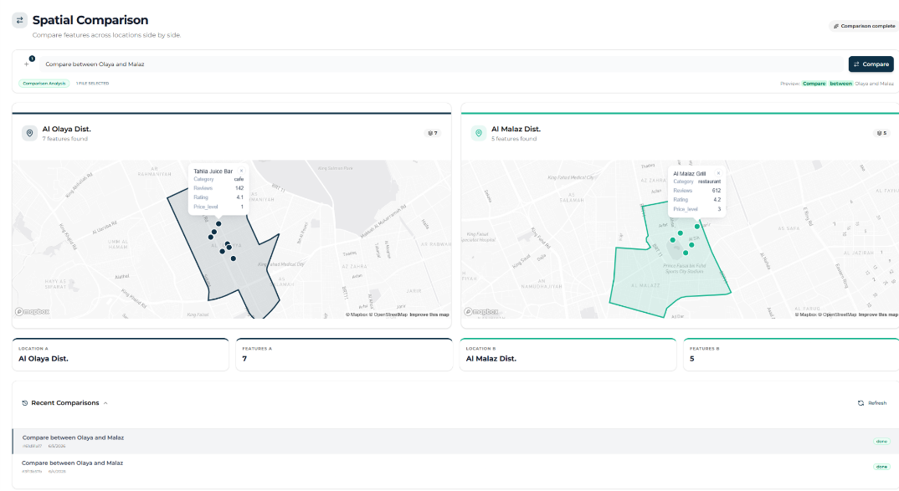
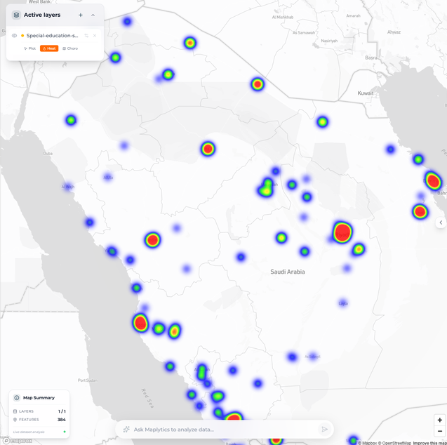
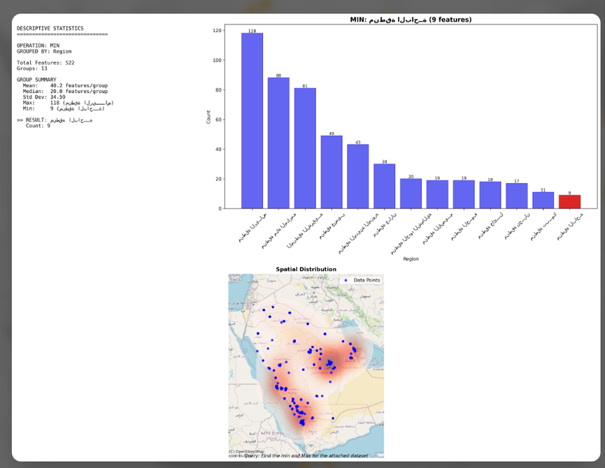
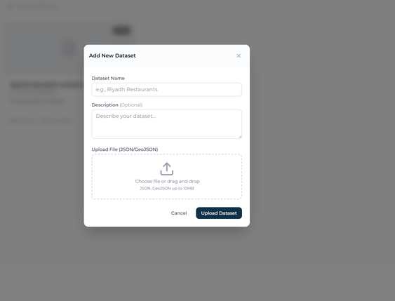
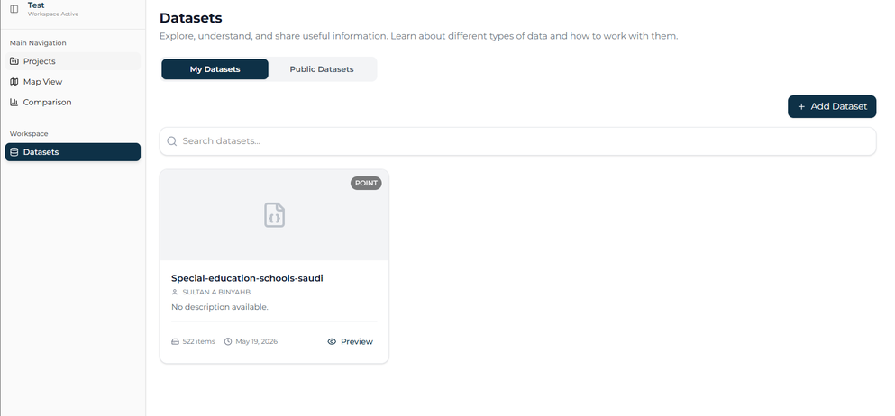
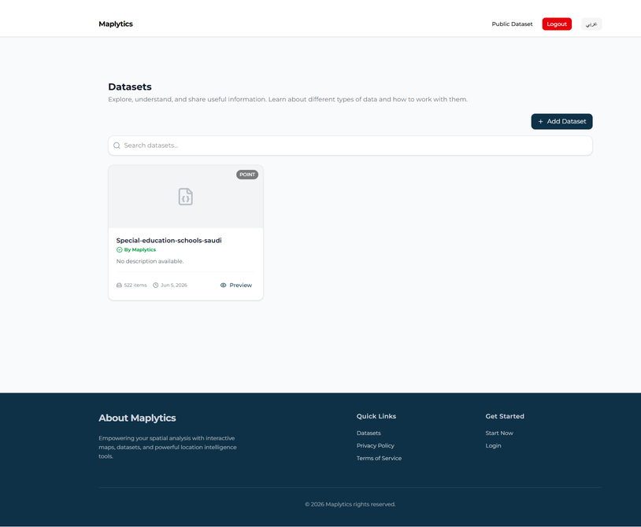
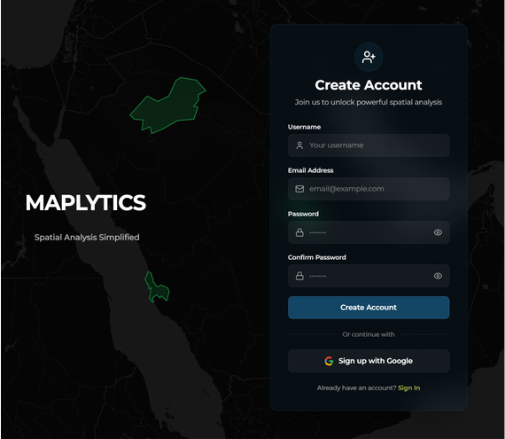
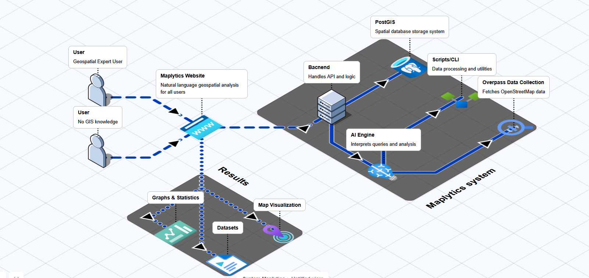

# Maplytics

**Maplytics** is an intelligent geospatial analysis platform that lets users perform spatial analysis and generate map visualizations using simple natural language queries — no GIS expertise, SQL, or specialized tools required.

Instead of learning complex GIS software, users can ask things like:

- *"Compare restaurants between Al Nuzha and Al Malaz"*
- *"Show population density by district"*
- *"Find cafes in Al-Hamra"*

...and get back interactive maps (choropleth, heatmap, point plots), comparison views, and descriptive statistics.



## Why

Traditional GIS tools (QGIS, ArcGIS) are powerful but require specialized technical knowledge and structured query languages. This creates a barrier for urban planners, business owners, and other non-technical stakeholders who need fast, intuitive access to spatial insights. Maplytics closes that gap by combining NLP-driven query parsing with a geospatial processing engine and dynamic visualization.

A survey of 97 respondents backing this project found the majority struggled with traditional GIS workflows, and 73.2% expressed strong interest in a natural-language-driven geospatial tool.

## Key Features

- **Natural language query interface** — classifies queries into aggregation, comparison, or descriptive analysis and extracts locations/features automatically (via spaCy + geopandas, not an LLM — chosen deliberately to avoid hallucination and keep results deterministic).
- **Choropleth maps** — colors administrative boundaries (regions/cities/districts) by point density using PostGIS spatial queries (`ST_Contains`), with 7 selectable color schemes.

  

- **Comparison queries** — side-by-side comparison of two locations (e.g. two districts or businesses), with color-coded markers and feature count summaries.

  

- **Heatmaps & descriptive statistics** — density visualizations, summary stats, and comparison bar charts.

  
  

- **Dataset upload & ingestion** — supports CSV, GeoJSON, and JSON array formats; auto-detects coordinate field naming conventions and normalizes everything into GeoJSON stored in PostGIS.

  

- **Public/private datasets** — datasets can be shared publicly or kept private, enabling community reuse without needing team structures.

  
  

- **Auth** — email/password and Google OAuth via Firebase.

  

## Architecture

Maplytics uses a modular, containerized architecture. Each service runs in its own Docker container:

- **Frontend** — Next.js / React.js
- **API server** — Node.js / Express
- **NLP / geospatial processing worker** — Python (spaCy for query parsing, geopandas for spatial operations, matplotlib/contextily for server-side rendering)
- **Database** — PostgreSQL + PostGIS (spatial queries, geometry storage)
- **Job queue** — Redis (async processing between API server and Python workers)
- **Object storage** — S3-compatible storage (RustFS) for dataset files
- **Map rendering** — Leaflet and Mapbox GL (both supported on the frontend)

**Flow:** User submits a natural language query → NLP layer classifies intent and extracts entities → job is queued in Redis → Python/geopandas worker (or a direct PostGIS query, for choropleth) executes the spatial operation → results are visualized and returned with a natural-language summary.



## Tech Stack

| Layer | Technology | Responsibility |
|---|---|---|
| Frontend | React.js, Next.js | UI, SSR/routing, dynamic rendering of maps/charts and query input |
| Backend / API | Node.js, Express | API endpoints, request handling, auth verification, job creation |
| Geospatial processing | Python, geopandas, spaCy | Parses NL queries, classifies intent, runs spatial operations (aggregation, comparison, filtering) |
| Database | PostgreSQL + PostGIS | Stores boundary geometries and feature data, executes spatial queries (e.g. `ST_Contains`) |
| Queue | Redis | Message queue between API server and Python workers for async job processing |
| Storage | S3-compatible (RustFS) | Stores uploaded dataset files and comparison job results |
| Auth | Firebase Authentication | Email/password and Google OAuth login, ID token verification |
| Map rendering | Leaflet, Mapbox GL | Interactive client-side rendering of choropleth maps, heatmaps, point layers |
| CI/CD | GitHub Actions | Automated testing, coverage reporting, build checks, deployment |
| Containerization | Docker | Isolated, reproducible environments per service |
| Testing | Jest, Supertest, React Testing Library | Unit, component, and integration test coverage |

## Testing

The project follows a multi-layered testing pyramid:

- **Unit tests** — utility functions, coordinate calculations, Redux reducers
- **Component tests** — React Testing Library + JSDOM
- **Integration tests** — Supertest against Express controllers/routes with Sequelize stubs

```bash
# Backend
cd api_server
npm run test
npm run test:coverage

# Frontend
cd nextjs_app
npm run test
npm run test:coverage
```

Coverage across core layers ranges roughly from 85% to 100%, enforced via GitHub Actions CI (separate backend and frontend quality gates), with automated deployment via SSH on merge to `main`.

## Team

| Name | Contribution |
|---|---|
| Ahmad Bugshan | UI design, choropleth implementation, statistical description tool, login/signup logic, protected routes |
| Sultan Binyahb | Database design, backend design, comparison view & tool, login/signup UI, backend testing |
| Abdullah Alhalawani | Backend design, landing page design, deployment lead, frontend testing, aggregate tool |

Supervised by PhD Khalid Alharbi — Department of Information Technology, Faculty of Computing and Information Technology, King Abdulaziz University, Jeddah.